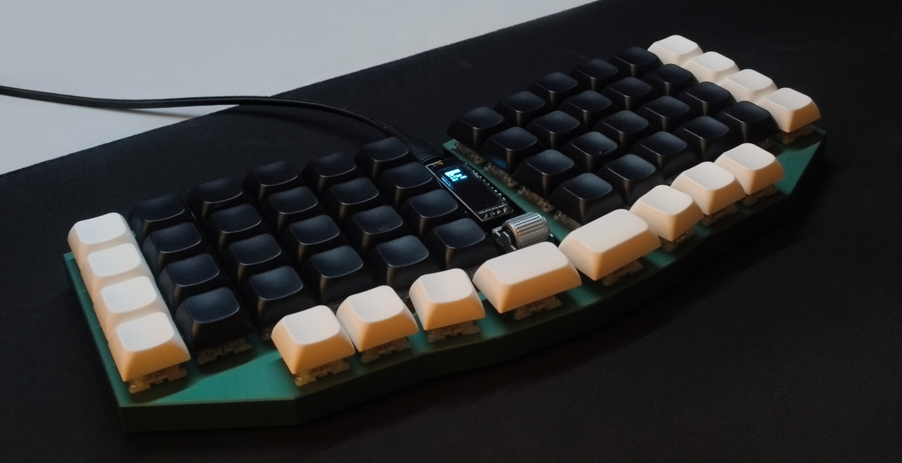
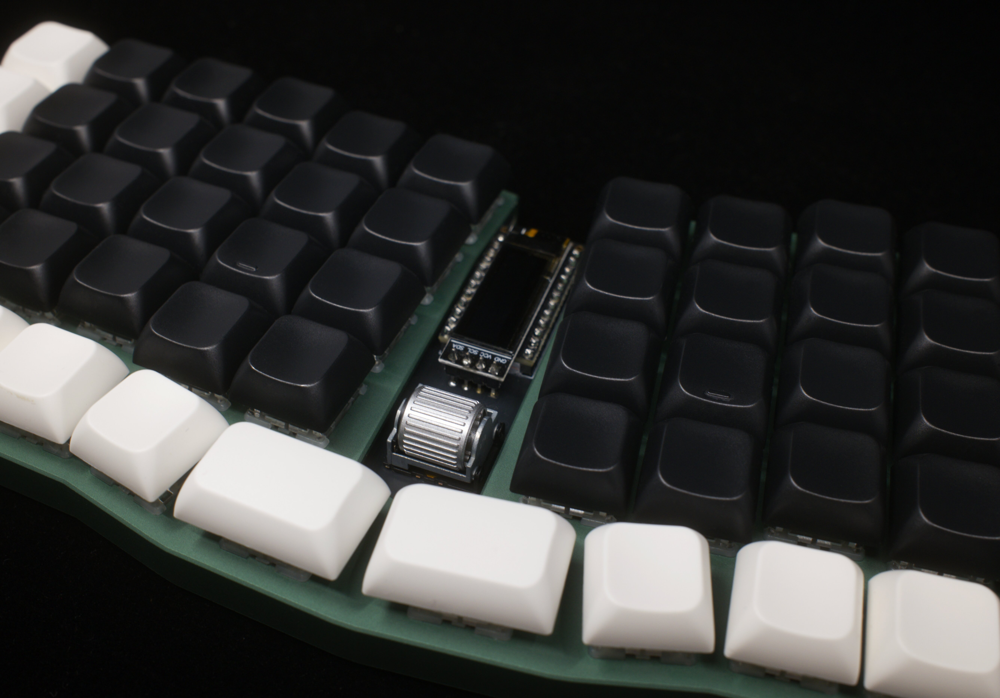
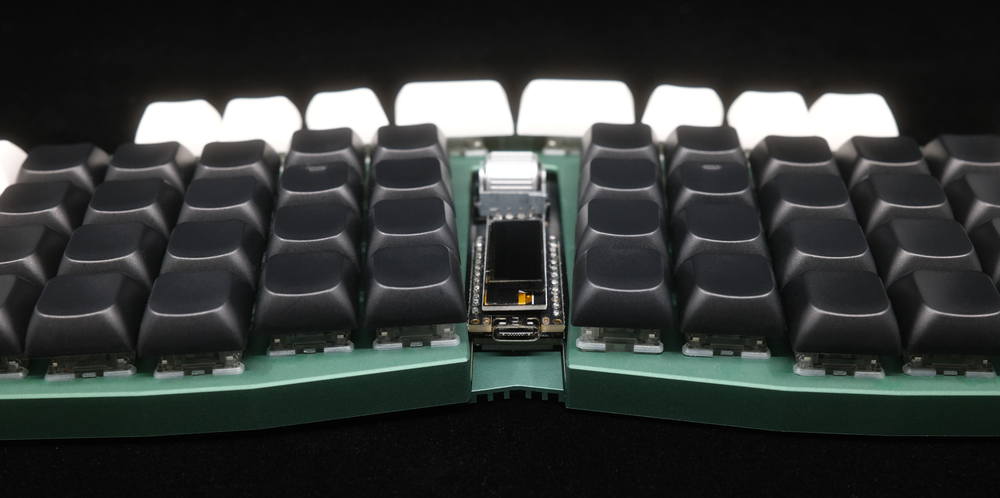

# TrueStrike56

|  |  |
| --- | --- |

TrueStrike56 is a spin-off from the original [TrueStrike42](https://github.com/byungyoonc/TrueStrike42) with an additional number row and 2 more thumb-keys. Making it a 4x6_4 layout.

# How to build
Refer to the [build guide](hw/rev2/README.md) for detailed instructions.

# Firmware
> [!WARNING]
> MCU will behave very erratic (e.g. sending random keypresses rapidly) right after flashing the firmware, before soldering all the components on the board. This is because MCU's analogue pins are connected to nothing, resulting in noise sensor values. 
>
> Disconnect the MCU from the PC as soon as possible after the successful firmware flash to prevent chaos.

## Use Precompiled Binary
Flash `fw/rev2/truestrike56_via.uf2` to your RP2040 microcontroller in bootloader mode.

## Build on Your Own
### Option A
Copy the `fw/rev2/truestrike56` folder into your cloned QMK Firmware repository's `keyboards` folder, then run `qmk compile -kb truestrike56 -km via`.

### Option B
- [QMK Firmware fork](https://github.com/byungyoonc/qmk_firmware/tree/Truestrike56)
- [VIA QMK Userspace fork](https://github.com/byungyoonc/qmk_userspace_via/tree/truestrike56)

The branches above are from my fork of the QMK Firmware/Userspace repository which supports firmware compilation for TrueStrike56. 

Follow [this guide for External QMK Userspace](https://docs.qmk.fm/newbs_external_userspace) to build it yourself.

# Using VIA HE Configurations
You can access the following tools in VIA by selecting **HE TOOLS**.

## Load VIA Definition
Open `fw/rev2/truestrike56.json` in VIA's **DESIGN** tab to enable VIA support for TrueStrike56.

## Calibrations
**Make sure to run the calibration at least once before using the keyboard!**

### Bottoming Calibration
Calibrates Hall-effect sensor values for each switch when it is fully bottomed out.

Toggle on, fully bottom out each switch, then toggle off.

### Noise Floor Calibration
Calibrates the ambient magnetic flux fluctuation detected by the Hall-effect sensors.

Click once while leaving the keyboard untouched for a brief period. The firmware samples the noise baseline.

### Show Calibration Data
Prints out current calibration data to the debug console.

### Clear Bottoming Calibration Data
Resets Bottoming Calibration Data to prepare for recalibration. Use this when replacing your Hall-effect switches.

## Actuation
### Mode
Choose between APC and Rapid Trigger.

APC works like a traditional digital switch, but you can change where actuation/release occurs.

Rapid Trigger tracks the switch's height to determine whether the key is being pressed down or released.

### Offsets
Sets the offset values for the selected Mode.

The value ranges from 1 (Topmost) to 255 (Bottommost).

# Credits

| Credit | Reason |
| ---: | --- |
| [byungyoonc](https://github.com/byungyoonc) | For the **entire** Engineering of the [PCBs](/hw) (rev1 and rev2) and the Technical side of things (including initial firmware setup) have been done by Byungyoon. |
| [74k1](https://github.com/74k1) | For the commission and the [Case](hw/rev2/case) as well as the small new logo. |
